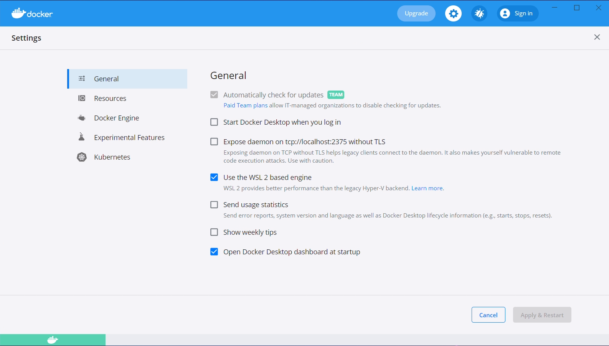
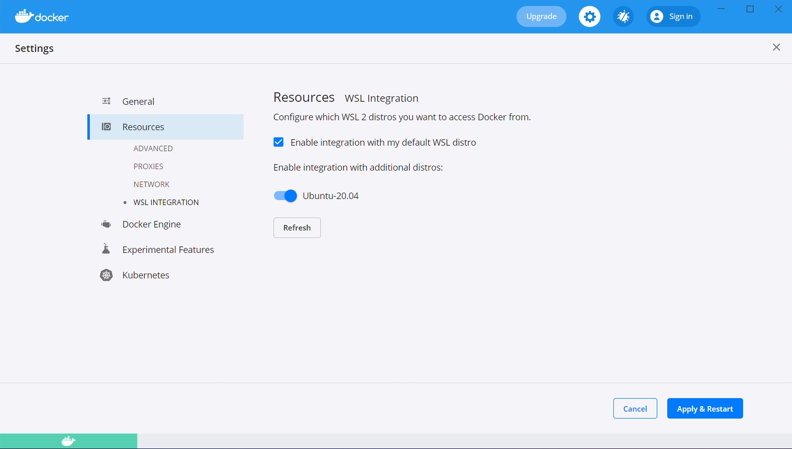
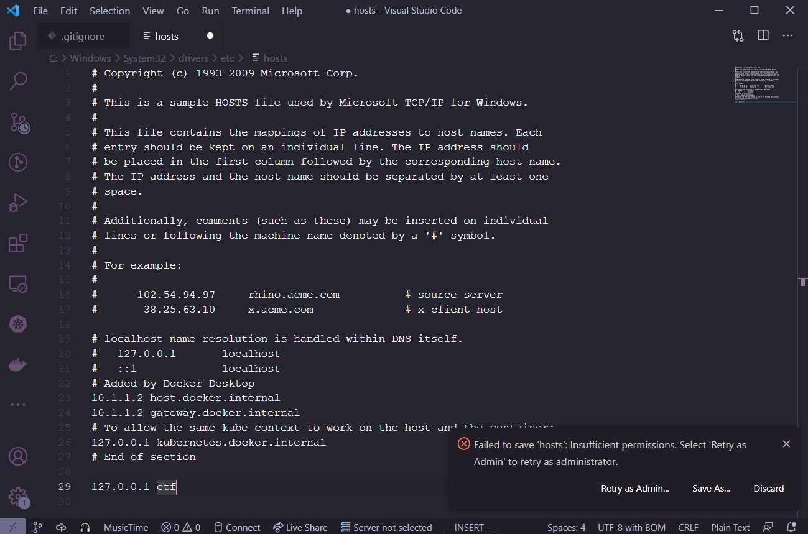

# Developing on Windows
This guide will introduce you to deploying and working on the Acasi CTF platform on Windows by
utilizing WSL 2 + Docker Desktop.

# Install WSL 2 and Docker Desktop
As WSL 2 and Docker Desktop are commercial products, there is quite extensive documentation on how
to install both of these available on their respective websites. The appropriate links are provided
below. 

[Install WSL 2](https://docs.microsoft.com/en-us/windows/wsl/install-win10#manual-installation-steps)

[Install Docker Desktop](https://docs.docker.com/docker-for-windows/install/)

# Configure Docker Desktop
## Enable WSL 2 Backend
To use Docker from within our WSL 2 virtual machine, we need to enable the WSL 2 based engine from
within Docker Desktop. From the main Docker Desktop window, click the settings gear and check the
"Use the WSL 2 based engine" option.



Additionally, navigate to "Resources", then to "WSL Integration". Check both the "Enable integration
with my default WSL distro", and the "Ubuntu-20.04" slider.



After both of these steps have been taken, click the "Apply & Restart" button.

## Add hosts entry
As an administrator, we need to add an entry to our local hosts file so that the "ctf" domain
directs to our local web server. Microsoft really enjoys hiding files deep inside the Windows
directory, the specific file we're looking for is `C:\Windows\system32\drivers\etc\hosts`.

The contents we want to add are as follows, do not remove anything from the file.
```
127.0.0.1 ctf
```

### Visual Studio Code
If you have Visual Studio Code installed, open the file in there, and Code will ask if you want to
escalate privileges in order to save the file.



### Notepad
If you don't have Visual Studio Code installed, run Notepad as administrator. Open the hosts file
and add the changes, then save it.

# Install Kubernetes utilities
The following script will download and install a few utilities that we are going to use in the rest
of this guide and for development on the platform.
```
curl https://raw.githubusercontent.com/acasi-ctf/docs/main/scripts/install-k8s-deps.sh | bash
```

# Configure WSL 2
## Create WSL user
In your WSL prompt, run the following, substituting USERNAME for the username of your choosing.
```
# Add new user
useradd -m USERNAME

# Set your user password
passwd USERNAME

# Add yourself to the sudo group
gpasswd --add USERNAME sudo
```

Edit /etc/wsl.conf and insert the following contents, substituting USERNAME with your chosen
username from the prior step.
```
[user]
default=USERNAME

[interop]
appendWindowsPath=false
```

After applying this configuration, open a PowerShell window, run this WSL command and then reopen
your WSL shell, as this will force it to stop.
```
wsl --shutdown
```

## Configure minikube
```
minikube config set driver docker
minikube start
```

## Add Bitnami Helm repo
```
helm repo add bitnami https://charts.bitnami.com/bitnami
```

## Install Ingress controller
An ingress controller gives us the ability to run one web server which will proxy to one or more
backend servers, allowing us to share a single hostname between those multiple backend servers.

```
kubectl apply -f https://raw.githubusercontent.com/kubernetes/ingress-nginx/controller-v0.48.1/deploy/static/provider/cloud/deploy.yaml
```

# Clone and build source
## Clone source
```
# Clone source from Git using SSH
git clone git@github.com:acasi-ctf/ctf.git

# Alternatively, use HTTPS if you don't have an SSH key installed
git clone https://github.com/acasi-ctf/ctf.git
```

**Temporary step: check out dev_docs_branch**
```
cd ctf
git checkout dev_docs
```

## Build Docker images
Now, build the Docker images for the platform. Ensure you're in the directory of the ctf repository.

```
# Activate the Docker environment
eval $(minikube -p minikube docker-env)

# Build docker images
make docker
```

# Deploy
## Create namespace
Kubernetes namespaces are a method of isolating resources, and is good practice to keep separate
projects in different namespaces for this reason.
```
# Create ctf namespace
kubectl create ns ctf

# Switch to new namespace
kubens ctf
```

## Create and deploy manifests
```
cd deploy

./generate_ssh_keys.sh minikube
cd minikube
helm install postgres bitnami/postgresql --values postgres-values.yaml
cd ..

kustomize build minikube > minikube.yaml
kubectl apply -f minikube.yaml
```

## Migrate the database
**This is a potential task for improvement.**

Currently, we need to manually migrate the PostgreSQL database. This is a fairly simple procedure,
but ideally would be automated in the future.

We need to get a shell for the pod that runs the frontend API. List the pods running in the ctf
namespace like so.
```
☁  ~  kubectl get pods
NAME                                         READY   STATUS        RESTARTS   AGE
ctf-frontend-584b4b9874-26vxx                1/1     Running       0          31d
ctf-operator-759457f978-d4q76                1/1     Running       0          31d
ctf-termproxy-69dc5c48cf-2pcl9               1/1     Running       0          31d
ctf-ui-dd5c4476b-lbc28                       1/1     Running       0          31d
postgres-postgresql-0
```

Locate the pod that starts with `ctf-frontend`. Make a note of the full name, in our case it is
`ctf-frontend-584b4b9874-26vxx`. Execute a bash shell in the pod and run the commands as provided.
```
☁  ~  kubectl exec -it ctf-frontend-584b4b9874-26vxx -- /bin/bash
root@ctf-frontend-584b4b9874-26vxx:/app# cd frontend
root@ctf-frontend-584b4b9874-26vxx:/app/frontend# flask db migrate
[...]
INFO  [alembic.runtime.migration] Context impl PostgresqlImpl.
INFO  [alembic.runtime.migration] Will assume transactional DDL.
INFO  [alembic.runtime.migration] Running upgrade  -> 6e85efd406c7, Initial migrations
INFO  [alembic.runtime.migration] Running upgrade 6e85efd406c7 -> 5213f9e65a8c, Add documentation table and minor adjustments
root@ctf-frontend-f7f4f445f-8tzkr:/app/frontend# exit
```

If you see at least a couple of `Running upgrade` lines, the migration succeeded.

## Accessing the UI
To access the UI, we need to enable the minikube tunnel. In your WSL shell, run `minikube tunnel`.
It should be noted that you will need to have the tunnel running during any development work, it is
not a permanent operation. You should see output similar to the following, requiring your sudo
password.

```
☁  ~  minikube tunnel
❗  The service ingress-nginx-controller requires privileged ports to be exposed: [80 443]
🔑  sudo permission will be asked for it.
🏃  Starting tunnel for service ingress-nginx-controller.
[sudo] password for lgorence:
```

The UI should now be accessible from your Windows machine by navigating to https://ctf/. As this is
running locally (nor is it a valid TLD), you will not have a valid SSL certificate, and your browser
will likely require you to accept the security risk. Brave may have issues with this, not allowing
you to bypass the risk.
